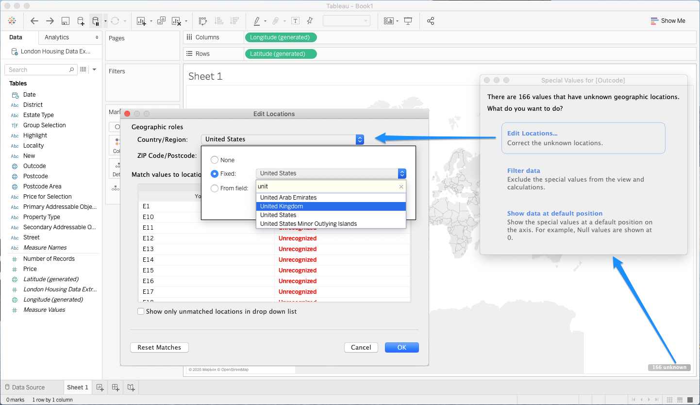
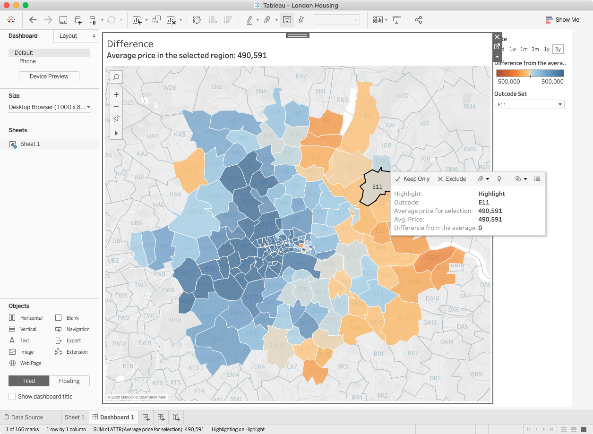

[Tableau Tim](https://tableautim.com/) from [The Information Lab](https://www.theinformationlab.co.uk/) has some wonderfully informative and easy-to-follow [YouTube videos about new features in Tableau 2020.2](https://www.youtube.com/playlist?list=PLRfaJ7ZL0cF4Pxo0QnJStUPysflgKcI8v). But I hit one little snag while trying to follow along with his video on [Tableau 2020.2 Set Controls](https://youtu.be/WR0qB_0Y2sI).

The Information Lab is based in the UK, so naturally their examples tend to be UK centric -- in this case, visualizing the difference in housing prices in different post codes around London. Tim was able to assign the "Outcode" field in his dataset to the "ZIP Code/Postcode" geographic role to get Tableau to correctly plot them on a map. But when I did the same, Tableau would still not recognize the values.

As a US Tableau user, I found that I needed to give Tableau a little more help to recognize the values. I had to click  "166 unknown" in the lower right corner, click "Edit Locations...", then change my default geographic locale from United States to United Kingdom. 

Once I did that, I was able to reproduce the rest of Tim's lesson exactly!

